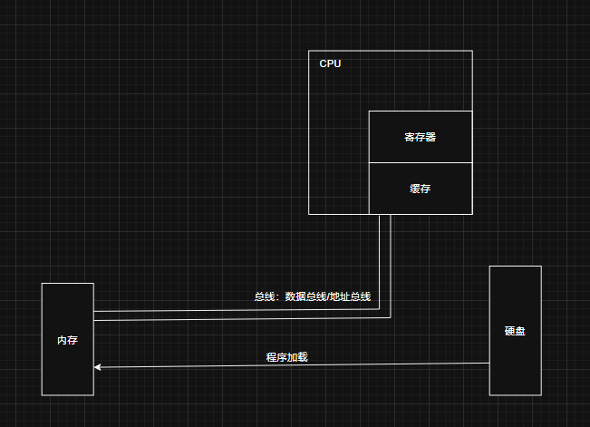

# C 语言基础语法

## 1. 预处理指令

```c
#include <stdio.h>
#include "stdio.h"
```

- `<>`: 在系统路径中寻找。
- `""`: 在指定路径中寻找，然后再在系统路径中寻找。

## 2. 在程序中使用其他程序

```c 
#include <stdio.h>
#include <stdlib.h> // system 存在这个库中

int main()
{
    system("ls");
    return 0;
}
```

## 3. C 语言的编译过程

| 过程  | 说明                             | 指令                          |
| --- | ------------------------------ | --------------------------- |
| 预编译 | 宏替换、头文件展开、条件编译、删除注释，并且不会检查语法错误 | `gcc -E hello.c -o hello.i` |
| 编译  | 将C语言转换为汇编代码                    | `gcc -S hello.i -o hello.s` |
| 汇编  | 将汇编代码转换为二进制文件                  | `gcc -c hello.s -o hello.o` |
| 链接  | 链接系统库                          | `gcc hello.o -o hello`      |

## 6. 程序运行时的内存、缓存、寄存器之间的关系



## 5. VS 提供的嵌入汇编语言

```c
#include <stdio.h>

int main()
{
    int a, b, c;
    
    __asm
    {
		mov a,3
	    mov b,4
	    mov eax,a
	    add eax,b
	    mov c,eax
    }
    
    printf("%d\n",c);
    return 0;
}
```

## 6. C 语言中包含的不安全函数
- C 语言中包含 `scanf` `strcpy` `sprintf` 三个不安全的函数, 会导致 C4996 错误.
- 解决方法:
	- 使用宏定义: `#define CRT_SECURE_NO_WARNINGS`
	- 另一种方式: `#pragma warning Cdisable:4996`